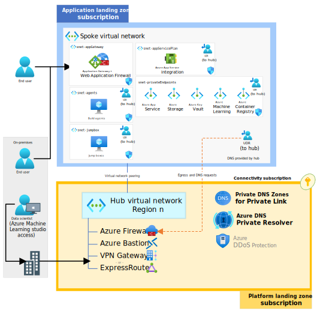
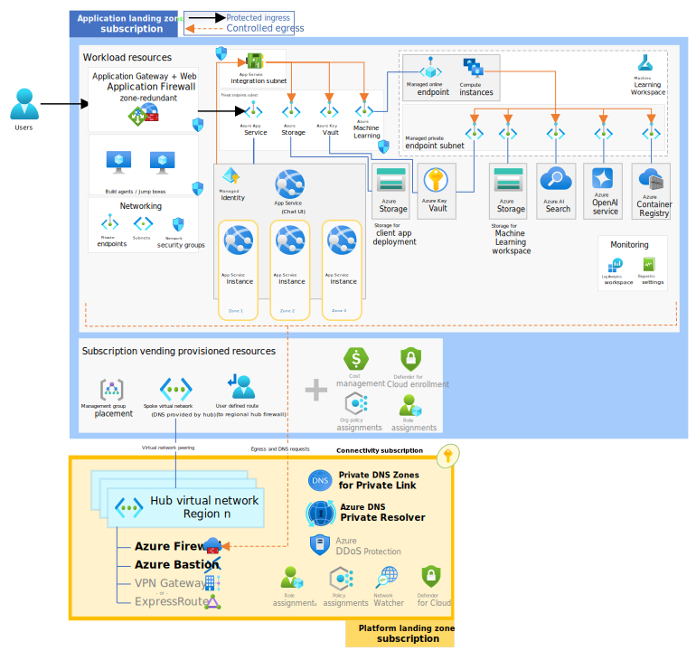
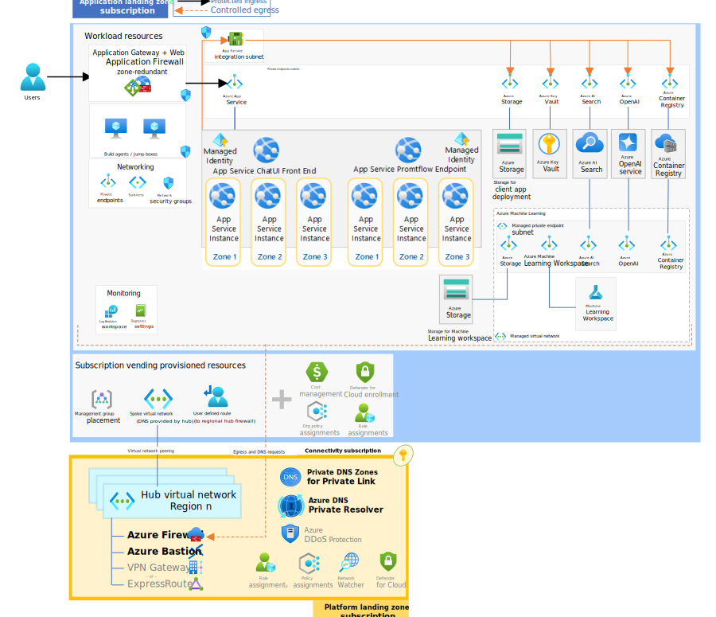

# Azure OpenAI chat baseline reference implementation in an application landing zone

This reference implementation extends the foundation set in the [Azure OpenAI end-to-end chat baseline](https://github.com/Azure-Samples/openai-end-to-end-baseline/) reference implementation. Specifically, this repo takes that reference implementation and deploys it within an application landing zone.

If you haven't yet, you should start by reviewing the [Azure OpenAI chat baseline architecture in an Azure landing zone](https://learn.microsoft.com/azure/architecture/ai-ml/architecture/azure-openai-baseline-landing-zone) article on Microsoft Learn. It sets important context for this implementation that is not covered in this deployment guide.

## Azure landing zone: application landing zone deployment

This application landing zone deployment guide assuming you are using a typical Azure landing zone approach with platform and workload seperation. This deployment assumes many pre-existing platform resources and deploys nothing outside of the scope of the application landing zone. That means to fully deploy this repo, it must be done so as part of your organization's actual subscription vending process.  If you do not have the ability to deploy into an actual application landing zone, then consider this simply reference material.

> [!IMPORTANT]
> Because organizations may implement landing zones different, it is expected that you will need to further adjust the deployment beyond the configuration provided.

### Differences from the Azure OpenAI end-to-end chat baseline reference implementation

The key differences when integrating the Azure OpenAI chat baseline into a application Azure landing zone as opposed to a fully standalone deployment are as follows:

- **Virtual network**: The virtual network will be deployed and configured by the platform team. This involves them providing a UDR and DNS configuration on the virtual network.

- **DNS forwarding**: Rather than using local DNS settings, the application's virtual network should be configured to use central DNS servers, such as Azure Firewall DNS Proxy or Azure Private DNS Resolver, for DNS forwarding. This centralizes DNS management and ensures consistency across the landscape.

- **Bastion host**: Instead of deploying an Azure Bastion host within the application's landing zone, a centralized bastion service already provisioned within the ALZ is used. This means all remote administrative traffic is routed through a common, secure access point, adhering to the principle of least privilege and centralized auditing.

- **Private DNS Zones**: Private endpoints within the application need to be integrated with centralized private DNS zones that are managed at the ALZ level. Such DNS zones might be shared across multiple applications or environments, simplifying the DNS management and providing an organized approach to name resolution.

- **Network virtual appliance (NVA)**: Outbound connectivity is handled through a centralized NVA, routing traffic via user-defined routes (UDRs) to enforce consistent network security policies and traffic inspections. This approach channels all outbound traffic through a central point where security measures such as firewalls and intrusion detection systems can be applied.

- **Compliance with centralized governance**: An ALZ comes with predefined governance policies regarding resource provisioning, network configurations, and security settings. Integrating with an ALZ demands compliance with these policies, ensuring that all deployments meet the organization's regulatory, compliance, and governance standards.

#### :recycle: Transitioning to Azure AI Studio

Azure patterns & practices team is transitioning this and related content from Azure Machine Learning workspaces to Azure AI Studio hub + projects. During ths transition period some of the assets might be out of sync with each other technology wise. Architecturally, these two technologies are very similar to each other, even down to the resource provider level. Pardon our dust as we make this transition across the assets. Here is the current status.

| Asset | Workspace |
| :---- | :-------- |
| [Basic implementation](https://github.com/Azure-Samples/openai-end-to-end-basic) | :ballot_box_with_check: AI Studio project |
| [Basic architecture on Microsoft Learn](https://learn.microsoft.com/azure/architecture/ai-ml/architecture/basic-openai-e2e-chat) | :ballot_box_with_check: AI Studio project |
| [Baseline implementation](https://github.com/Azure-Samples/openai-end-to-end-baseline) | :white_square_button: AML workspace |
| [Baseline architecture on Microsoft Learn](https://learn.microsoft.com/azure/architecture/ai-ml/architecture/baseline-openai-e2e-chat) | :white_square_button: AML workspace |
| Azure landing zone implementation *(this repo)* | :white_square_button: AML workspace |
| [Azure landing zone architecture on Microsoft Learn](https://learn.microsoft.com/azure/architecture/ai-ml/architecture/azure-openai-baseline-landing-zone) | :white_square_button: AML workspace |

### Integration with existing platform services

Most of the configuration for this scenario is in the **parameters.alz.json** file, which specifies the integration points for existing Azure services such as the spoke virtual network, the UDR to route internet traffic. It also includes an external DNS server address and the IP address of an existing Network Virtual Appliance (NVA) for routing configuration.

## Architecture

Just like the baseline reference implementation, this implementation covers the same following scenarios:

1. Authoring a flow - Authoring a flow using prompt flow in an Azure Machine Learning workspace
1. Deploying a flow to Azure Machine Learning (AML hosted option) - The deployment of an executable flow to an Azure Machine Learning online endpoint. The client UI that is hosted in Azure App Service accesses the deployed flow.
1. Deploying a flow to Azure App Service (Self-hosted option) - The deployment of an executable flow as a container to Azure App Service. The client UI that accesses the flow is also hosted in Azure App Service.

### Authoring a flow



The authoring architecture diagram illustrates how flow authors [connect to an Azure Machine Learning Workspace through a private endpoint](https://learn.microsoft.com/azure/machine-learning/how-to-configure-private-link) in a virtual network. In this case, the author connects to the virtual network through routing established by the platform team that supports workstation-based connectivity.

The diagram further illustrates how the Machine Learning Workspace is configured for [Workspace managed virtual network isolation](https://learn.microsoft.com/azure/machine-learning/how-to-managed-network). With this configuration, a managed virtual network is created, along with managed private endpoints enabling connectivity to private resources such as the workplace Azure Storage and Azure Container Registry. You can also create user-defined connections like private endpoints to connect to resources like Azure OpenAI and Azure AI Search.

### Deploying a flow to Azure Machine Learning managed online endpoint



The Azure Machine Learning deployment architecture diagram illustrates how a front-end web application, deployed into a [network-secured App Service](https://github.com/Azure-Samples/app-service-baseline-implementation), [connects to a managed online endpoint through a private endpoint](https://learn.microsoft.com/azure/machine-learning/how-to-configure-private-link) in a virtual network. Like the authoring flow, the diagram illustrates how the Machine Learning Workspace is configured for [Workspace managed virtual network isolation](https://learn.microsoft.com/azure/machine-learning/how-to-managed-network). The deployed flow is able to connect to required resources such as Azure OpenAI and Azure AI Search through managed private endpoints.

### Deploying a flow to Azure App Service (alternative)



The Azure App Service deployment architecture diagram illustrates how the same prompt flow can be containerized and deployed to Azure App Service alongside the same front-end web application from the prior architecture. This solution is a completely self-hosted, externalized alternative to an Azure Machine Learning managed online endpoint.

The flow is still authored in a network-isolated Azure Machine Learning workspace. To deploy in App Service in this architecture, the flows need to be containerized and pushed to the Azure Container Registry that is accessible through private endpoints to the App Service.

## Deployment guide

Follow these instructions to deploy this example to your Azure subscription, try out what you've deployed, and learn how to clean up those resources.

> [!WARNING]
> The deployment steps assume you have an application landing zone already provisioned through your subscription vending process. This deployment will not work unless you have permission to manage subnets on a existing virtual network and means to ensure private endpoint DNS configuration (such as platform provided DINE Azure Policy). It also requires your platform team to have required NVA allowances on the hub's egress firewall.

### Prerequisites

- You have an application landing zone ready for this deployment that contains the following platform-provided resources:

  - One virtual network (spoke)
    - Must be at least a `/22`
    - DNS configuration set for hub-based resolution
    - Peering fully established between the hub and the spoke as well as the spoke and the hub
    - In the same region as your workload resources

  - One unassociated route table to force Internet-bound traffic through a platform-provided NVA *(if not using Azure VWAN)*
    - In the same region as your spoke virtual network

  - A mechanism to get private endpoint DNS registered with the DNS services set in the virtual network configuration

- The application landing zone subscription must have the following quota available in the location you'll select to deploy this implementation.

  - Azure OpenAI: Standard, GPT-35-Turbo, 25K TPM
  - Storage Accounts: 2 instances
  - App Service Plans: P1v3 (AZ), 3 instances
  - Azure DDoS protection plan: 1
  - Standard, static Public IP Addresses: 2
  - Standard DASv4 Family Cluster Dedicated vCPUs for machine learning: 8

- The application landing zone subscription must have the following resource providers [registered](https://learn.microsoft.com/azure/azure-resource-manager/management/resource-providers-and-types#register-resource-provider).

  - `Microsoft.AlertsManagement`
  - `Microsoft.CognitiveServices`
  - `Microsoft.Compute`
  - `Microsoft.ContainerRegistry`
  - `Microsoft.KeyVault`
  - `Microsoft.Insights`
  - `Microsoft.MachineLearningServices`
  - `Microsoft.ManagedIdentity`
  - `Microsoft.Network`
  - `Microsoft.OperationalInsights`
  - `Microsoft.Storage`
  - `Microsoft.Web`

- Your deployment user must have the following permissions at the application landing zone subscription scope.

  - Ability to assign [Azure roles](https://learn.microsoft.com/azure/role-based-access-control/built-in-roles) on newly created resource groups and resources. (E.g. `User Access Administrator` or `Owner`)
  - Ability to purge deleted AI services resources. (E.g. `Contributor` or `Cognitive Services Contributor`)

- The [Azure CLI installed](https://learn.microsoft.com/cli/azure/install-azure-cli)

  If you're executing this from WSL, be sure the Azure CLI is installed in WSL and is not using the version installed in Windows. `which az` should show `/usr/bin/az`.

- The [OpenSSL CLI](https://docs.openssl.org/3.3/man7/ossl-guide-introduction/#getting-and-installing-openssl) installed.

### 1. :rocket: Deploy the infrastructure

The following steps are required to deploy the infrastructure from the command line.

1. In your shell, clone this repo and navigate to the root directory of this repository.

   ```bash
   git clone https://github.com/Azure-Samples/azure-openai-chat-baseline-landing-zone
   cd azure-openai-chat-baseline-landing-zone
   ```

1. Log in and set the application landing zone subscription.

   ```bash
   az login
   az account set --subscription xxxxx
   ```

1. Obtain the App Gateway certificate

   Azure Application Gateway support for secure TLS using Azure Key Vault and managed identities for Azure resources. This configuration enables end-to-end encryption of the network traffic using standard TLS protocols. For production systems, you should use a publicly signed certificate backed by a public root certificate authority (CA). Here, we will use a self-signed certificate for demonstration purposes.

   ```bash
   DOMAIN_NAME_APPSERV="contoso.com"
   ```

   :warning: Do not use the certificate created by this script for actual deployments. The use of self-signed certificates are provided for ease of illustration purposes only. Use your organization's requirements for procurement and lifetime management of TLS certificates, *even for development purposes*.

   Create the certificate that will be presented to web clients by Azure Application Gateway for your domain.

   ```bash
   openssl req -x509 -nodes -days 365 -newkey rsa:2048 -out appgw.crt -keyout appgw.key -subj "/CN=${DOMAIN_NAME_APPSERV}/O=Contoso" -addext "subjectAltName = DNS:${DOMAIN_NAME_APPSERV}" -addext "keyUsage = digitalSignature" -addext "extendedKeyUsage = serverAuth"
   openssl pkcs12 -export -out appgw.pfx -in appgw.crt -inkey appgw.key -passout pass:
   ```

   Base64 encode the client-facing certificate.

   :bulb: No matter if you used a certificate from your organization or generated one from above, you'll need the certificate (as `.pfx`) to be Base64 encoded for proper storage in Key Vault later.

   ```bash
   APP_GATEWAY_LISTENER_CERTIFICATE=$(cat appgw.pfx | base64 | tr -d '\n')
   echo APP_GATEWAY_LISTENER_CERTIFICATE: $APP_GATEWAY_LISTENER_CERTIFICATE
   ```

1. Update the **infra-as-code/parameters.alz.json** file with all references to your platform team-provided resources.

   You must set the following json values:

   - `existingResourceIdForSpokeVirtualNetwork`: Set this to the resource ID of the spoke virtual network the platform team deployed into your application landing zone subscription.
   - `existingResourceIdForUdrForInternetTraffic`: Set this to the resource ID of the UDR the platform team deployed into your application landing zone subscription. Leave blank if your platform team is using VWAN-provided route tables instead.
   - `bastionSubnetAddresses`: Set this to the `AzureBastionSubnet` range for the Azure Bastion hosts provided by your platform team for VM connectivity (used in jump boxes or build agents).
   - The five `...AddressPrefix` values for the subnets in this architecture. The values must be within the platform-allocated address space for spoke and must be large enough for their respective services. Tip: Update the example ranges, not the subnet mask.

1. Set the deployment location to one with available quota in your application landing zone subscription.

   The location you choose must [support availability zones](https://learn.microsoft.com/azure/reliability/availability-zones-service-support) as well.

   ```bash
   LOCATION=eastus
   ```

1. Set the base name value that will be used as part of the Azure resource names for the resources deployed in this solution.

   ```bash
   BASE_NAME=<base resource name, between 6 and 8 lowercase characters, all DNS names will include this text, so it must be unique.>
   ```

1. Create a resource group and deploy the workload infrastructure.

   ```bash
   RESOURCE_GROUP="rg-chat-resources-${LOCATION}"

   az group create -l $LOCATION -n $RESOURCE_GROUP

   # This takes about 30 minutes to run.
   az deployment sub create -f ./infra-as-code/bicep/main.bicep \
     -n chat-baseline-000 \
     -l $LOCATION \
     -p @./infra-as-code/bicep/parameters.alz.json \
     -p baseName=${BASE_NAME} workloadResourceGroupName=${RESOURCE_GROUP} appGatewayListenerCertificate=${APP_GATEWAY_LISTENER_CERTIFICATE}
   ```

### 2. Deploy a Prompt flow from Azure Machine Learning workspace

You'll need to perform this from your workstation that has a private network line of sight to your deployed Machine Learning workspace. This connection is typically established by the platform team. If instead you use a jump box for access, then use the Azure Bastion provided by your platform team. These instructions assume you're on a workstation or connected to a jump box that can access the Azure Machine Learning studio and Azure OpenAI studio.

1. Deploy jump box, **if necessary**. _Skip this if your platform team has provided workstation based access or another method._

   If you need to deploy a jump box into your application landing zone, this deployment guide has a simple one that you can use. You will be prompted for an admin password for the jump box; it must satisfy the [complexity requirements for Windows VM in Azure](https://learn.microsoft.com/azure/virtual-machines/windows/faq#what-are-the-password-requirements-when-creating-a-vm-). You'll need to identify your landing zone virtual network as well in **infra-as-code/bicep/jumpbox/parameters.json**. This is the same value you used in **infra-as-code/bicep/parameters.alz.json**.

   ```bash
   az deployment group create -f ./infra-as-code/bicep/jumpbox/jumpbox.bicep \
      -g $RESOURCE_GROUP \
      -p @./infra-as-code/bicep/jumpbox/parameters.json \
      -p baseName=$BASE_NAME
   ```

   Your hub's egress firewall will need various application rule allowances to support this use case. Below are some key destinations that need to be opened from your jump box's subnet:

   - `ml.azure.com:443`
   - `login.microsoftonline.com:443`
   - `login.live.com:443`
   - and many more...

1. Open the [Machine Learning Workspace](https://ml.azure.com/) and choose your workspace. Ensure you have [enabled prompt flow in your Azure Machine Learning workspace](https://learn.microsoft.com/azure/machine-learning/prompt-flow/get-started-prompt-flow?view=azureml-api-2#prerequisites-enable-prompt-flow-in-your-azure-machine-learning-workspace).

1. Create a prompt flow connection to your gpt35 Azure OpenAI model deployment. This will be used by the prompt flow you clone in the next step.

    1. Click on 'Connections' in the left navigation in Machine Learning Studio
    1. Click 'Create' and select 'Azure OpenAI Service'
    1. Click 'Enter manually' and fill out the properties:
       - Endpoint: \<Choose the endpoint from Keys and Endpoint in your Azure OpenAI instance in the portal - https://{name}.openai.azure.com/>
       - Authentication: API Key
       - Key: \<Choose a key from Keys and Endpoint in your Azure OpenAI instance in the portal>
       - Connection name: 'gpt35'   **Make sure you use this name.**

1. Clone an existing example prompt flow

    1. Click on 'Prompt flow' in the left navigation in Machine Learning Studio
    1. Click on the 'Flows' tab and click 'Create'
    1. Click 'Clone' under 'Chat with Wikipedia'
    1. Name the folder _chat_wiki_ and Press 'Clone'
    1. Set the 'Connection' and 'deployment_name' to 'gpt35' and set the max_tokens property of the deployment_name to 256, for the following two steps:
        - extract_query_from_question
        - augmented_chat
    1. Save

1. Add runtime

   1. Click the 'Select runtime' dropdown box.
   1. Click 'Start with advanced settings' and choose 'Compute instance'
   1. Choose the compute instance created by the Bicep
   1. Accept the other defaults and click 'Activate'

### 3. Test the Prompt flow from Azure Machine Learning workspace

1. :clock8: Wait for the runtime to be created. This may take about five minutes.

   *Do not advance until the serverless compute is running.*

1. Select the runtime in the UI

1. Click the enabled **Chat** button on the UI.

1. Enter a question that would require grounding data through recent Wikipedia content, such as a notable current event.

1. A grounded response to your question should appear on the UI.

### 4. Deploy the Prompt flow to an Azure Machine Learning managed online endpoint

Here you'll take your tested flow and deploy it to a managed online endpoint.

1. Click on 'Deploy' in the UI

1. Choose 'Existing' Endpoint and select the one called _ept-<basename>_.

1. Name the deployment ept-<basename>. **Make sure you name the deployment ept-<basename>. An App Service environment variable is set, assuming that naming convention**

1. Choose a small Virtual Machine size for testing and set the number of instances.

1. Press 'Review + Create'

1. Press 'Create'

### 5. Publish the chat front-end web app

This architecture uses [run from zip file in App Service](https://learn.microsoft.com/azure/app-service/deploy-run-package). This approach has many benefits, including eliminating file lock conflicts when deploying.

> :bulb: Read through the next steps, but follow the guidance in the [Workaround](#workaround) section.

To use run from zip, you do the following:

- Create a [project zip package](https://learn.microsoft.com/azure/app-service/deploy-run-package#create-a-project-zip-package) which is a zip file of your project.
- Upload that zip file to a location accessible to your website. This implementation uses private endpoints to connect to the storage account securely. The web app has a managed identity authorized to access the blob.
- Set the environment variable `WEBSITE_RUN_FROM_PACKAGE` to the URL of the zip file.

In a production environment, you would likely use a CI/CD pipeline to:

- Build your application
- Create the project zip package
- Upload the zip file to your storage account

The CI/CD pipeline would likely use a [self-hosted agent](https://learn.microsoft.com/azure/devops/pipelines/agents/agents?view=azure-devops&tabs=browser#install) that can connect to the storage account through a private endpoint to upload the zip. We have not implemented that here.

#### Workaround

You need a workaround to upload the file to the storage account because these instructions have not implemented a CI/CD pipeline with a self-hosted agent. There are two workaround steps you need to do in order to manually upload the zip file using the portal.

- The deployed storage account does not allow public access, so you will need to temporarily allow access public access from your IP address.
- You must authorize your user to upload a blob to the storage account.

Run the following commands to:

- Allow public access from your IP address.
- Give the logged-in user permission to upload a blob
- Upload the zip file `./website/chatui.zip` to the existing `deploy` container
- Tell the web app to restart

```bash
CLIENT_IP_ADDRESS=$(curl ifconfig.me)

STORAGE_ACCOUNT_PREFIX=st
WEB_APP_PREFIX=app-
NAME_OF_STORAGE_ACCOUNT="$STORAGE_ACCOUNT_PREFIX$BASE_NAME"
NAME_OF_WEB_APP="$WEB_APP_PREFIX$BASE_NAME"
LOGGED_IN_USER_ID=$(az ad signed-in-user show --query id -o tsv)
RESOURCE_GROUP_ID=$(az group show --resource-group $RESOURCE_GROUP --query id -o tsv)
STORAGE_BLOB_DATA_CONTRIBUTOR=ba92f5b4-2d11-453d-a403-e96b0029c9fe

az storage account network-rule add -g $RESOURCE_GROUP --account-name $NAME_OF_STORAGE_ACCOUNT --ip-address $CLIENT_IP_ADDRESS
az role assignment create --assignee-principal-type User --assignee-object-id $LOGGED_IN_USER_ID --role $STORAGE_BLOB_DATA_CONTRIBUTOR --scope $RESOURCE_GROUP_ID

az storage blob upload -f ./website/chatui.zip \
  --account-name $NAME_OF_STORAGE_ACCOUNT \
  --auth-mode login \
  -c deploy -n chatui.zip

az webapp restart --name $NAME_OF_WEB_APP --resource-group $RESOURCE_GROUP
```

### 6. Validate the web app

This section will help you to validate that the workload is exposed correctly and responding to HTTP requests.

#### Steps

1. Get the public IP address of the Application Gateway.

   > :book: The app team conducts a final acceptance test to be sure that traffic is flowing end-to-end as expected, so they place a request against the Azure Application Gateway endpoint.

   ```bash
   # query the Azure Application Gateway Public IP
   APPGW_PUBLIC_IP=$(az network public-ip show --resource-group $RESOURCE_GROUP --name "pip-$BASE_NAME" --query [ipAddress] --output tsv)
   echo APPGW_PUBLIC_IP: $APPGW_PUBLIC_IP
   ```

1. Create an `A` record for DNS.

   > :bulb: You can simulate this via a local hosts file modification.  Alternatively, you can add a real DNS entry for your specific deployment's application domain name if permission to do so.

   Map the Azure Application Gateway public IP address to the application domain name. To do that, please edit your hosts file (`C:\Windows\System32\drivers\etc\hosts` or `/etc/hosts`) and add the following record to the end: `${APPGW_PUBLIC_IP} www.${DOMAIN_NAME_APPSERV}` (e.g. `50.140.130.120  www.contoso.com`)

1. Browse to the site (e.g. <https://www.contoso.com>).

   > :bulb: It may take up to a few minutes for the App Service to start properly. Remember to include the protocol prefix `https://` in the URL you type in your browser's address bar. A TLS warning will be present due to using a self-signed certificate. You can ignore it or import the self-signed cert (`appgw.pfx`) to your user's trusted root store.

### 7. Deploying the flow to Azure App Service option

This is a second option for deploying the flow. With this option, you deploy the flow to Azure App Service instead of the managed online endpoint. At a high-level, you must do the following:

- Prerequisites - Ensure you have the prerequisites
- Download your flow - Download the flow from the Machine Learning Workspace
- Build the flow - Use the ```pf``` CLI to build your flow
- Build and push the image - Containerize the flow and push to your Azure Container Registry
- Publish the image to Azure App Service

#### Prerequisites for this option

The following are additional requirements for building the image, pushing to ACR, and deploying to Azure App Service:

- Python
- Anaconda
- Promptflow pf CLI

Below are commands to create and activate a conda environment and install the prompt flow tools. See [Set up your dev environment](https://microsoft.github.io/promptflow/how-to-guides/quick-start.html#set-up-your-dev-environment) for more information.

```bash
conda create --name pf python=3.11.4
conda activate pf
pip install promptflow promptflow-tools

# You will need to install the following if you build the docker image locally
pip install keyrings.alt
pip install bs4
```

#### Download your flow

1. Open the prompt flow UI in Azure Machine Learning studio
1. Expand the **Files** tab in the right pane of the UI
1. Click on the download icon to download the flow as a zip file

> :bulb: If you are using a jump box to connect to Azure Machine Learning workspace, when you download the flow, it will be downloaded to your jump box. You will either need to have the prerequisites installed on the jump box, or you will need to transfer the zip file to a workstations that has the prerequisites.

#### Build the flow

> :bulb: This example assumes your flow has a connection to Azure OpenAI

1. Unzip the prompt flow zip file you downloaded
1. In your terminal, change the directory to the root of the unzipped flow
1. Create a folder called 'connections'
1. Create a file for each connection you created in the prompt flow UI

   1. Make sure you name the file to match the name you gave the connection. For example, if you named your connection 'gpt35' in prompt flow, create a file called 'gpt35.yaml' under the connections folder.
   1. Enter the following values in the file:

      ```text
      $schema: https://azuremlschemas.azureedge.net/promptflow/latest/AzureOpenAIConnection.schema.json
      name: gpt35
      type: azure_open_ai
      api_key: "${env:OPENAICONNECTION_API_KEY}"
      api_base: "${env:OPENAICONNECTION_API_BASE}"
      api_type: "azure"
      api_version: "2023-07-01-preview"
      ```

      > :bulb: The App Service is configured with App Settings that surface as environment variables for ```OPENAICONNECTION_API_KEY``` and ```OPENAICONNECTION_API_BASE```.

1. Bundle the prompt flow to support creating a container image.

   ```bash
   pf flow build --source ./ --output dist --format docker
   ```

   The following code will create a folder named 'dist' with a docker file and all the required flow files.

#### Build and push the image

1. Ensure the requirements.txt in the dist/flow folder has the appropriate requirements. At the time of writing, they were as follows:

   ```bash
   promptflow[azure]
   promptflow-tools==0.1.0.b5
   python-dotenv
   bs4
   ```

1. Ensure the connections folder with the connection was created in the dist folder. If not, copy the connections folder, along with the connection file to the dist folder.

1. Make sure you have network access to your Azure Container Registry and have an RBAC role such as ACRPush that will allow you to push an image. If you are running on a local workstation, you can set ```Public network access``` to ```All networks``` or ```Selected networks``` and add your machine IP to the allowed IP list.

1. Build and push the container image.

   Run the following commands from the dist folder in your terminal:

   ```azurecli
   az login

   NAME_OF_ACR="cr$BASE_NAME"
   ACR_CONTAINER_NAME="aoai"
   IMAGE_NAME="wikichatflow"
   IMAGE_TAG="1.1"
   FULL_IMAGE_NAME="$ACR_CONTAINER_NAME/$IMAGE_NAME:$IMAGE_TAG"

   az acr build -t $FULL_IMAGE_NAME -r $NAME_OF_ACR .
   ```

#### Host the chat flow container image in Azure App Service

Perform the following steps to deploy the container image to Azure App Service:

1. Set the container image on the pf App Service.

   ```azurecli
   PF_APP_SERVICE_NAME="app-$BASE_NAME-pf"
   ACR_IMAGE_NAME="$NAME_OF_ACR.azurecr.io/$ACR_CONTAINER_NAME/$IMAGE_NAME:$IMAGE_TAG"

   az webapp config container set --name $PF_APP_SERVICE_NAME --resource-group $RESOURCE_GROUP --docker-custom-image-name $ACR_IMAGE_NAME --docker-registry-server-url https://$NAME_OF_ACR.azurecr.io
   az webapp deployment container config --enable-cd true --name $PF_APP_SERVICE_NAME --resource-group $RESOURCE_GROUP
   ```

1. Modify the configuration setting in the App Service that has the chat UI and point it to your deployed promptflow endpoint hosted in App Service instead of the managed online endpoint.

   ```azurecli
   UI_APP_SERVICE_NAME="app-$BASE_NAME"
   ENDPOINT_URL="https://$PF_APP_SERVICE_NAME.azurewebsites.net/score"

   az webapp config appsettings set --name $UI_APP_SERVICE_NAME --resource-group $RESOURCE_GROUP --settings chatApiEndpoint=$ENDPOINT_URL
   az webapp restart --name $UI_APP_SERVICE_NAME --resource-group $RESOURCE_GROUP
   ```

## :checkered_flag: Try it out. Test the final deployment

| :computer: | Unless otherwise noted, all of the remaining steps are performed from your original workstation, not from the jump box. |
| :--------: | :------------------------- |

Browse to the site (e.g. <https://www.contoso.com>) once again. Once you're there, ask your solution a question. Like before, you question should ideally involve recent data or events, something that would only be known by the RAG process including content from Wikipedia.

In this final configuration, your chat UI is asking the prompt flow code hosted in another Web App in your Azure App Service instance. Your Azure Machine Learning online endpoint is not used, and Wikipedia and Azure OpenAI is being called right from your prompt flow Web App.

## :broom: Clean up resources

Most Azure resources deployed in the prior steps will incur ongoing charges unless removed. Additionally, a few of the resources deployed go into a soft delete status which may restrict the ability to redeploy another resource with the same name and may not release quota, so it is best to purge any soft deleted resources once you are done exploring. Use the following commands to delete the deployed resources and resource group and to purge each of the resources with soft delete.

| :warning: | This will completely delete any data you may have included in this example. That data and this deployment will be unrecoverable. |
| :--------: | :------------------------- |

```bash
az group delete --name $RESOURCE_GROUP -y

az keyvault purge  -n kv-${BASE_NAME}
az cognitiveservices account purge -g $RESOURCE_GROUP -l $LOCATION -n oai-${BASE_NAME}
```

## Contributions

Please see our [Contributor guide](./CONTRIBUTING.md).

This project has adopted the [Microsoft Open Source Code of Conduct](https://opensource.microsoft.com/codeofconduct/). For more information see the [Code of Conduct FAQ](https://opensource.microsoft.com/codeofconduct/faq/) or contact <opencode@microsoft.com> with any additional questions or comments.

With :heart: from Azure Patterns & Practices, [Azure Architecture Center](https://azure.com/architecture).
