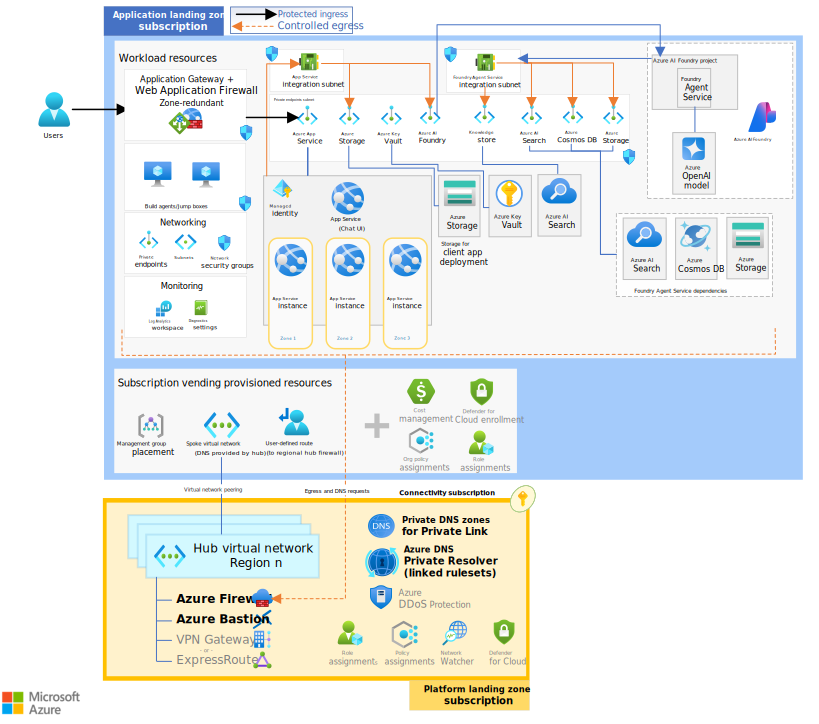
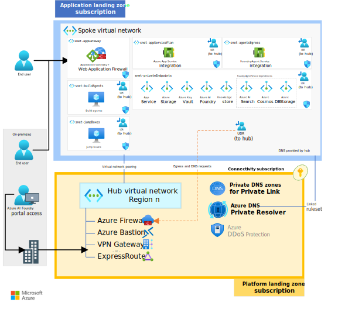

# Azure AI Foundry Agent Service chat baseline reference implementation in an application landing zone

This reference implementation extends the foundation set in the [Azure AI Foundry Agent Service chat baseline](https://github.com/Azure-Samples/openai-end-to-end-baseline/) reference implementation. Specifically, this repository takes that reference implementation and deploys it within an application landing zone.

If you haven't yet, you should start by reviewing the [Baseline Azure AI Foundry chat reference architecture in an Azure landing zone](https://learn.microsoft.com/azure/architecture/ai-ml/architecture/azure-openai-baseline-landing-zone) article on Microsoft Learn. It sets important context for this implementation that is not covered in this deployment guide.

## Azure landing zone: application landing zone deployment

This application landing zone deployment guide assuming you are using a typical Azure landing zone approach with platform and workload separation. This deployment assumes many pre-existing platform resources and deploys nothing outside of the scope of the application landing zone. That means to fully deploy this repo, it must be done so as part of your organization's actual subscription vending process. If you do not have the ability to deploy into an actual application landing zone, then consider this simply reference material.

> [!IMPORTANT]
> Because organizations may implement landing zones different, it is *expected* that you will need to further adjust the deployment beyond the configuration provided.

### Differences from the Azure OpenAI end-to-end chat baseline reference implementation

The key differences when integrating the Azure AI Foundry Agent Service chat baseline into an application landing zone as opposed to a fully standalone deployment are as follows:

- **Virtual network**: The virtual network will be deployed and configured by the platform team. This involves them providing a UDR and DNS configuration on the virtual network. The subnets are still under the control of the workload team.

- **DNS forwarding**: Rather than using local DNS settings, the application's virtual network likely will be configured to use central DNS servers, such as Azure Firewall DNS Proxy or Azure Private DNS Resolver, for DNS forwarding. This centralizes DNS management and ensures consistency across the landscape.

  | :warning: | Azure AI Foundry will require Azure Private DNS resolver to inject specific rules to resolve its dependencies. |
  | :-------: | :------------------------- |


- **Bastion host**: Instead of deploying an Azure Bastion host within the application's landing zone, a centralized bastion service already provisioned within the platform landing zone subscriptions is used. This means all remote administrative traffic is routed through a common, secure access point, adhering to the principle of least privilege and centralized auditing.

- **Private DNS Zones**: Private endpoints within the application need to be integrated with centralized private DNS zones that are managed at the platform landing zone level. Such DNS zones might be shared across multiple applications or environments, simplifying the DNS management and providing an organized approach to name resolution.

- **Network virtual appliance (NVA)**: the centralized NVA and user-defined routes (UDRs) configurations are now managed by the platform team and have been relocated at the hub-spoke level accordingly.

- **Compliance with centralized governance**: An application landing zone comes with predefined governance policies regarding resource provisioning, network configurations, and security settings. Integrating with the Azure landing zone structure demands compliance with these policies, ensuring that all deployments meet the organization's regulatory, compliance, and governance standards.

### Integration with existing platform services

Partial configuration for this scenario is in the **parameters.alz.json** file, currently specifies the subnet address prefixes for the following subnets:

- `snet-appGateway`: The subnet for the Azure Application Gateway.
- `snet-appServicePlan`: The subnet for the Azure App Service.
- `snet-privateEndpoints`: The subnet for the Azure Private Endpoint.
- `snet-agentsEgress`: The subnet for the Azure AI Foundry Agent Service.
- `snet-jumpBoxes`: The subnet for the jumboxes.
- `snet-buildAgents`: The subnet for the build agents.

## Architecture

Just like the baseline reference implementation, this implementation covers the same following three scenarios:

- [Setting up Azure AI Foundry to host agents](#setting-up-azure-ai-foundry-to-host-agents)
- [Deploying an agent into Azure AI Foundry Agent Service](#deploying-an-agent-into-azure-ai-foundry-agent-service)
- [Invoking the agent from .NET code hosted in an Azure Web App](#invoking-the-agent-from-net-code-hosted-in-an-azure-web-app)



*Download a [Visio file](docs/media/baseline-azure-ai-foundry-landing-zone.vsdx) of this architecture.*

### Setting up Azure AI Foundry to host agents

Azure AI Foundry hosts Azure AI Foundry Agent Service as a capability. Foundry Agent service's REST APIs are exposed as an AI Foundry private endpoint within the network, and the agents' all egress through a delegated subnet which is routed through Azure Firewall for any internet traffic. This architecture deploys the Foundry Agent Service with its dependencies hosted within your own Azure Application landing zone subscription. As such, this architecture includes an Azure Storage account, Azure AI Search instance, and an Azure Cosmos DB account specifically for the Foundry Agent Service to manage.

### Deploying an agent into Azure AI Foundry Agent Service

Agents can be created via the Azure AI Foundry portal, Azure AI Persistent Agents client library, or the REST API. The creation and invocation of agents are a data plane operation. Since the data plane to Azure AI Foundry is private, all three of those are restricted to being executed from within a private network connected to the private endpoint of Azure AI Foundry.

Ideally agents should be source-controlled and a versioned asset. You then can deploy agents in a coordinated way with the rest of your workload's code. In this deployment guide, you'll create an agent from the jump box to simulate a deployment pipeline which could have created the agent.

If using the Azure AI Foundry portal is desired, then the web browser experience must be performed from a VM within the network or from a workstation that has VPN access to the private network and can properly resolve private DNS records.

### Invoking the agent from .NET code hosted in an Azure Web App

A chat UI application is deployed into a private Azure App Service. The UI is accessed through Application Gateway (WAF). The .NET code uses the Azure AI Persistent Agents client library to connect to the workload's agent. The endpoint for the agent is exposed exclusively through the Azure AI Foundry private endpoint.

## Deployment guide

Follow these instructions to deploy this example to your application landing zone subscription, try out what you've deployed, and learn how to clean up those resources.

> [!WARNING]
> The deployment steps assume you have an application landing zone already provisioned through your subscription vending process. This deployment will not work unless you have permission to manage subnets on an existing virtual network and means to ensure private endpoint DNS configuration (such as platform provided DINE Azure Policy). It also requires your platform team to have required NVA allowances on the hub's egress firewall and configured Azure DNS Forwarding rulesets targeting the Azure DNS Private Resolver input IP address for the following Azure AI Foundry capability host domain dependencies.



*Download a [Visio file](docs/media/baseline-landing-zone-networking.vsdx) of this architecture.*

### Prerequisites

- You have an application landing zone subscription ready for this deployment that contains the following platform-provided resources:

  - One virtual network (hub)
    - Azure Bastion
    - Azure Jumbox VM with connectivity to your Azure application landing zone subscription
    - DNS Forwarding ruleset configuration targeting the Azure Private DNS resolver inbound endpoint ip address for the specific Azure AI Foundry capability host domain depdencies as listed below:
      - `documents.azure.com`
      - `search.windows.net`
      - `blob.core.windows.net`

  - One virtual network (spoke)
    - Must be at least a `/22`
    - DNS configuration set for hub-based resolution
    - Peering fully established between the hub and the spoke as well as the spoke and the hub
    - In the same region as your workload resources

  - One unassociated route table to force Internet-bound traffic through a platform-provided NVA *(if not using Azure VWAN)*
    - In the same region as your spoke virtual network

  - A mechanism to get private endpoint DNS registered with the DNS services set in the virtual network configuration

- The application landing zone subscription must have the following quota available in the location you'll select to deploy this implementation.

  - Application Gateways: 1 WAF_v2 tier instance
  - App Service Plans: P1v3 (AZ), 3 instances
  - Azure AI Search (S - Standard): 1
  - Azure Cosmos DB: 1 account
  - Azure OpenAI in Foundry Model: GPT-4 model deployment with 50k TPM capacity
  - DDoS Protection Plans: 1
  - Public IPv4 Addresses - Standard: 4
  - Storage Accounts: 2

- The application landing zone subscription must have the following resource providers [registered](https://learn.microsoft.com/azure/azure-resource-manager/management/resource-providers-and-types#register-resource-provider).

  - `Microsoft.AlertsManagement`
  - `Microsoft.App`
  - `Microsoft.Bing`
  - `Microsoft.CognitiveServices`
  - `Microsoft.Compute`
  - `Microsoft.DocumentDB`
  - `Microsoft.Insights`
  - `Microsoft.KeyVault`
  - `Microsoft.ManagedIdentity`
  - `Microsoft.Network`
  - `Microsoft.OperationalInsights`
  - `Microsoft.Search`
  - `Microsoft.Storage`
  - `Microsoft.Web`

- Your deployment user must have the following permissions at the application landing zone subscription scope.

  - Ability to assign [Azure roles](https://learn.microsoft.com/azure/role-based-access-control/built-in-roles) on newly created resource groups and resources. (E.g. `User Access Administrator` or `Owner`)
  - Ability to purge deleted AI services resources. (E.g. `Contributor` or `Cognitive Services Contributor`)

- The [Azure CLI installed](https://learn.microsoft.com/cli/azure/install-azure-cli)

  If you're executing this from WSL, be sure the Azure CLI is installed in WSL and is not using the version installed in Windows. `which az` should show `/usr/bin/az`.

- The [OpenSSL CLI](https://docs.openssl.org/3.3/man7/ossl-guide-introduction/#getting-and-installing-openssl) installed.

### 1. :rocket: Deploy the infrastructure

The following steps are required to deploy the infrastructure from the command line.

1. In your shell, clone this repo and navigate to the root directory of this repository.

   ```bash
   git clone https://github.com/Azure-Samples/azure-openai-chat-baseline-landing-zone
   cd azure-openai-chat-baseline-landing-zone
   ```

1. Log in and set the application landing zone subscription.

   ```bash
   az login
   az account set --subscription xxxxx
   ```

1. Obtain the App Gateway certificate

   Azure Application Gateway support for secure TLS using Azure Key Vault and managed identities for Azure resources. This configuration enables end-to-end encryption of the network traffic using standard TLS protocols. For production systems, you should use a publicly signed certificate backed by a public root certificate authority (CA). Here, we will use a self-signed certificate for demonstration purposes.

   - Set a variable for the domain used in the rest of this deployment.

     ```bash
     DOMAIN_NAME_APPSERV="contoso.com"
     ```

   - Generate a client-facing, self-signed TLS certificate.

     :warning: Do not use the certificate created by this script for actual deployments. The use of self-signed certificates are provided for ease of illustration purposes only. For your App Service solution, use your organization's requirements for procurement and lifetime management of TLS certificates, *even for development purposes*.

     Create the certificate that will be presented to web clients by Azure Application Gateway for your domain.

     ```bash
     openssl req -x509 -nodes -days 365 -newkey rsa:2048 -out appgw.crt -keyout appgw.key -subj "/CN=${DOMAIN_NAME_APPSERV}/O=Contoso" -addext "subjectAltName = DNS:${DOMAIN_NAME_APPSERV}" -addext "keyUsage = digitalSignature" -addext "extendedKeyUsage = serverAuth"
     openssl pkcs12 -export -out appgw.pfx -in appgw.crt -inkey appgw.key -passout pass:
     ```

   - Base64 encode the client-facing certificate.

     :bulb: No matter if you used a certificate from your organization or generated one from above, you'll need the certificate (as `.pfx`) to be Base64 encoded for proper storage in Key Vault later.

     ```bash
     APP_GATEWAY_LISTENER_CERTIFICATE=$(cat appgw.pfx | base64 | tr -d '\n')
     echo APP_GATEWAY_LISTENER_CERTIFICATE: $APP_GATEWAY_LISTENER_CERTIFICATE
     ```

1. Update the **infra-as-code/bicep/parameters.alz.json** file if needed.

   - This parameters file contains the four `...AddressPrefix` values for the subnets in this architecture. The values must be within the platform-allocated address space for spoke and must be large enough for their respective services. Tip: Update the example ranges, not the subnet mask.

1.  You must obtain from your platform team the following values:

   - `existingResourceIdForSpokeVirtualNetwork`: The resource ID of the spoke virtual network the platform team deployed into your application landing zone subscription.
   - `existingResourceIdForUdrForInternetTraffic`: The resource ID of the UDR the platform team deployed into your application landing zone subscription. Leave blank if your platform team is using VWAN-provided route tables instead.

   ```bash
   SPOKE_RESOURCE_ID=<existing-platform-given-spoke-resource-id>
   UDR_SPOKE_RESOURCE_ID=<existing-platform-given-udr-spoke-resource-id>
   ```

1. Set the resource deployment location to the location of where the virtual network was provisioned for you.

   The location one that [supports availability zones](https://learn.microsoft.com/azure/reliability/availability-zones-service-support) and has available quota. This deployment has been tested in the following locations: `australiaeast`, `eastus`, `eastus2`, `francecentral`, `japaneast`, `southcentralus`, `swedencentral`, `switzerlandnorth`, or `uksouth`. You might be successful in other locations as well.

   ```bash
   LOCATION=eastus2
   ```

1. Set the base name value that will be used as part of the Azure resource names for the resources deployed in this solution.

   ```bash
   BASE_NAME=<base resource name, between 6 and 8 lowercase characters, all DNS names will include this text, so it must be unique.>
   ```

1. Create a resource group and deploy the workload infrastructure prequisites.

   *There is an optional tracking ID on this deployment. To opt out of its use, add the following parameter to the deployment code below: `-p telemetryOptOut true`.*

   :clock8: *This might take about 20 minutes.*

   ```bash
   RESOURCE_GROUP="rg-chat-alz-baseline-${BASE_NAME}"
   az group create -l $LOCATION -n $RESOURCE_GROUP

   PRINCIPAL_ID=$(az ad signed-in-user show --query id -o tsv)

   az deployment sub create -f ./infra-as-code/bicep/main.bicep \
     -n ai-foundry-chat-prereq-lz-baseline-${BASE_NAME} \
     -l $LOCATION \
     -p workloadResourceGroupName=${RESOURCE_GROUP} \
     -p baseName=${BASE_NAME} \
     -p customDomainName=${DOMAIN_NAME_APPSERV} \
     -p appGatewayListenerCertificate=${APP_GATEWAY_LISTENER_CERTIFICATE} \
     -p existingResourceIdForSpokeVirtualNetwork=${SPOKE_RESOURCE_ID} \
     -p existingResourceIdForUdrForInternetTraffic=${UDR_SPOKE_RESOURCE_ID} \
     -p yourPrincipalId=${PRINCIPAL_ID} \
     -p @./infra-as-code/bicep/parameters.alz.json
   ```

   | :warning: | Before you deploy Azure AI Foundry and its agent capability, you must wait until the Foundry Agent Service dependencies are fully resolvable to their private endpoints from within the spoke network. This requirement is especially important if DINE policies handle updates to DNS private zones. If you attempt to deploy the Foundry Agent Service capability before the private DNS records are resolvable from within your subnet, the deployment fails. |
   | :-------: | :------------------------- |

1. Get workload prequisites outputs

   ```bash
   AIFOUNDRY_NAME=$(az deployment sub show --name ai-foundry-chat-prereq-lz-baseline-${BASE_NAME} --query "properties.outputs.aiFoundryName.value" -o tsv)
   COSMOSDB_ACCOUNT_NAME=$(az deployment sub show --name ai-foundry-chat-prereq-lz-baseline-${BASE_NAME} --query "properties.outputs.cosmosDbAccountName.value" -o tsv)
   STORAGE_ACCOUNT_NAME=$(az deployment sub show --name ai-foundry-chat-prereq-lz-baseline-${BASE_NAME} --query "properties.outputs.storageAccountName.value" -o tsv)
   AISEARCH_ACCOUNT_NAME=$(az deployment sub show --name ai-foundry-chat-prereq-lz-baseline-${BASE_NAME} --query "properties.outputs.aiSearchAccountName.value" -o tsv)
   BING_ACCOUNT_NAME=$(az deployment sub show --name ai-foundry-chat-prereq-lz-baseline-${BASE_NAME} --query "properties.outputs.bingAccountName.value" -o tsv)
   WEBAPP_APPINSIGHTS_NAME=$(az deployment sub show --name ai-foundry-chat-prereq-lz-baseline-${BASE_NAME} --query "properties.outputs.webApplicationInsightsResourceName.value" -o tsv)
   ```

1. Deploy Azure AI Foundry project and agent capability host


   ```bash
   az deployment group create -f ./infra-as-code/bicep/ai-foundry-project.bicep \
     -n ai-foundry-chat-lz-baseline-${BASE_NAME} \
     -g ${RESOURCE_GROUP} \
     -p existingAiFoundryName=${AIFOUNDRY_NAME} \
     -p existingCosmosDbAccountName=${COSMOSDB_ACCOUNT_NAME} \
     -p existingStorageAccountName=${STORAGE_ACCOUNT_NAME} \
     -p existingAISearchAccountName=${AISEARCH_ACCOUNT_NAME} \
     -p existingBingAccountName=${BING_ACCOUNT_NAME} \
     -p existingWebApplicationInsightsResourceName=${WEBAPP_APPINSIGHTS_NAME}
   ```

### 2. Deploy an agent in the Azure AI Foundry Agent Service

To test this scenario, you'll be deploying an AI agent included in this repository. The agent uses a GPT model combined with a Bing search for grounding data. Deploying an AI agent requires data plane access to Azure AI Foundry. In this architecture, a network perimeter is established, and you must interact with the Azure AI Foundry portal and its resources from within the network.

The AI agent definition would likely be deployed from your application's pipeline running from a build agent in your workload's network or it could be deployed via singleton code in your web application. In this deployment, you'll create the agent from the jump box, which most closely simulates pipeline-based creation.

1. Deploy a jump box, **if necessary**. *Skip this if your platform team has provided workstation-based access or another method.*

   If you need to deploy a jump box into your application landing zone, this deployment guide has a simple one that you can use. You will be prompted for an admin password for the jump box; it must satisfy the [complexity requirements for Windows VM in Azure](https://learn.microsoft.com/azure/virtual-machines/windows/faq#what-are-the-password-requirements-when-creating-a-vm-). You'll need to identify your landing zone virtual network as well in **infra-as-code/bicep/jumpbox/parameters.json**. This is the same value you used in **infra-as-code/bicep/parameters.alz.json**.

   *There is an optional tracking ID on this deployment. To opt out of the deployment tracking, add the following parameter to the deployment code below: `-p telemetryOptOut true`.*

   ```bash
   az deployment group create -f ./infra-as-code/bicep/jumpbox/jumpbox.bicep \
      -g $RESOURCE_GROUP \
      -p @./infra-as-code/bicep/jumpbox/parameters.json \
      -p baseName=$BASE_NAME
   ```

   The username for the Windows jump box deployed in this solution is `vmadmin`.

   Your hub's egress firewall will need various application rule allowances to support this use case. Below are some key destinations that need to be opened from your jump box's subnet:

   - `ai.azure.com:443`
   - `login.microsoftonline.com:443`
   - `login.live.com:443`
   - and many more...

1. Connect to the virtual network via the deployed [Azure Bastion and the jump box](https://learn.microsoft.com/azure/bastion/bastion-connect-vm-rdp-windows#rdp). Alternatively, you can connect through a force-tunneled VPN or virtual network peering that you manually configure apart from these instructions.

   The username for the Windows jump box deployed in this solution is `vmadmin`. You provided the password during the deployment.

   | :computer: | Unless otherwise noted, the following steps are performed from the jump box or from your VPN-connected workstation. The instructions are written as if you are a Windows jump box. Adjust accordingly if using a Linux virtual machine. |
   | :--------: | :------------------------- |

1. Open PowerShell from the Terminal app. Log in and select your target subscription.

   ```powershell
   az login
   az account set --subscription xxxxx
   ```

1. Set the base name to the same value it was when you deployed the resources.

   ```powershell
   $BASE_NAME="<exact same value used before>"
   ```

1. Generate some variables to set context within your jump box.

   *The following variables align with the defaults in this deployment. Update them if you customized anything.*

   ```powershell
   $RESOURCE_GROUP="rg-chat-alz-baseline-${BASE_NAME}"
   $AI_FOUNDRY_NAME="aif${BASE_NAME}"
   $BING_CONNECTION_NAME="bingaiagent${BASE_NAME}"
   $AI_FOUNDRY_PROJECT_NAME="projchat"
   $MODEL_CONNECTION_NAME="agent-model"
   $BING_CONNECTION_ID="$(az cognitiveservices account show -n $AI_FOUNDRY_NAME -g $RESOURCE_GROUP --query 'id' --out tsv)/projects/${AI_FOUNDRY_PROJECT_NAME}/connections/${BING_CONNECTION_NAME}"
   $AI_FOUNDRY_AGENT_CREATE_URL="https://${AI_FOUNDRY_NAME}.services.ai.azure.com/api/projects/${AI_FOUNDRY_PROJECT_NAME}/assistants?api-version=2025-05-15-preview"

   echo $BING_CONNECTION_ID
   echo $MODEL_CONNECTION_NAME
   echo $AI_FOUNDRY_AGENT_CREATE_URL
   ```

1. Deploy the agent.

   *This step simulates deploying an AI agent through your pipeline from a network-connected build agent.*

   ```powershell
   # Use the agent definition on disk
   Invoke-WebRequest -Uri "https://github.com/Azure-Samples/openai-end-to-end-baseline/raw/refs/heads/main/agents/chat-with-bing.json" -OutFile "chat-with-bing.json"

   # Update to match your environment
   ${c:chat-with-bing-output.json} = ${c:chat-with-bing.json} -replace 'MODEL_CONNECTION_NAME', $MODEL_CONNECTION_NAME -replace 'BING_CONNECTION_ID', $BING_CONNECTION_ID

   # Deploy the agent
   az rest -u $AI_FOUNDRY_AGENT_CREATE_URL -m "post" --resource "https://ai.azure.com" -b @chat-with-bing-output.json

   # Capture the Agent's ID
   $AGENT_ID="$(az rest -u $AI_FOUNDRY_AGENT_CREATE_URL -m 'get' --resource 'https://ai.azure.com' --query 'data[0].id' -o tsv)"

   echo $AGENT_ID
   ```

### 3. Test the agent from the Azure AI Foundry portal in the playground. *Optional.*

Here you'll test your orchestration agent by invoking it directly from the Azure AI Foundry portal's playground experience. The Azure AI Foundry portal is only accessible from your private network, so you'll do this from your jump box.

*This step testing step is completely optional.*

1. Open the Azure portal to your subscription.

   You'll need to sign in to the Azure portal, and resolve any Entra ID Conditional Access policies on your account, if this is the first time you are connecting through the jump box.

1. Navigate to the Azure AI Foundry project named **projchat** in your resource group and open the Azure AI Foundry portal by clicking the **Go to Azure AI Foundry portal** button.

   This will take you directly into the 'Chat project'. Alternatively, you can find all your AI Foundry accounts and projects by going to <https://ai.azure.com> and you do not need to use the Azure portal to access them.

1. Click **Agents** in the side navigation.

1. Select the agent named 'Baseline Chatbot Agent'.

1. Click the **Try in playground** button.

1. Enter a question that would require grounding data through recent internet content, such as a notable recent event or the weather today in your location.

1. A grounded response to your question should appear on the UI.

### 4. Publish the chat front-end web app

Workloads build chat functionality into an application. Those interfaces usually call APIs which in turn call into your orchestrator. This implementation comes with such an interface. You'll deploy it to Azure App Service using its [run from package](https://learn.microsoft.com/azure/app-service/deploy-run-package) capabilities.

In a production environment, you use a CI/CD pipeline to:

- Build your web application
- Create the project zip package
- Upload the zip file to your Storage account from compute that is in or connected to the workload's virtual network.

For this deployment guide, you'll continue using your jump box to simulate part of that process.

1. Using the same PowerShell terminal session from previous steps, download the web UI.

   ```powershell
   Invoke-WebRequest -Uri https://github.com/Azure-Samples/openai-end-to-end-baseline/raw/refs/heads/main/website/chatui.zip -OutFile chatui.zip
   ```

1. Upload the web application to Azure Storage, where the web app will load the code from.

   ```powershell
   az storage blob upload -f chatui.zip --account-name "stwebapp${BASE_NAME}" --auth-mode login -c deploy -n chatui.zip
   ```

1. Update the app configuration to use the Azure AI Foundry project endpoint you deployed.

   ```powershell
   # Obtain the Azure AI Foundry project endpoint you deployed
   $AIFOUNDRY_PROJECT_ENDPOINT=$(az deployment group show -g "${RESOURCE_GROUP}" -n "ai-foundry-chat-lz-baseline-${BASE_NAME}" --query "properties.outputs.aiAgentProjectEndpoint.value" -o tsv)

   # Update the app configuration
   az webapp config appsettings set -n "app-${BASE_NAME}" -g $RESOURCE_GROUP --settings AIProjectEndpoint="${AIFOUNDRY_RPOJECT_ENDPOINT}"
   ```

1. Update the app configuration to use the agent you deployed.

   ```powershell
   az webapp config appsettings set -n "app-${BASE_NAME}" -g $RESOURCE_GROUP --settings AIAgentId="${AGENT_ID}"
   ```

1. Restart the web app to load the site code and its updated configuation.

   ```powershell
   az webapp restart --name "app-${BASE_NAME}" --resource-group $RESOURCE_GROUP
   ```

### 5. Try it out! Test the deployed application that calls into the Azure AI Foundry Agent Service

This section will help you to validate that the workload is exposed correctly and responding to HTTP requests. This will validate that traffic is flowing through Application Gateway, into your Web App, and from your Web App, into the Azure AI Foundry agent API endpoint, which hosts the agent and its chat history. The agent will interface with Bing for grounding data and an OpenAI model for generative responses.

| :computer: | Unless otherwise noted, the following steps are all performed from your original workstation, not from the jump box. |
| :--------: | :------------------------- |

1. Get the public IP address of the Application Gateway.

   ```bash
   # Query the Azure Application Gateway Public IP
   APPGW_PUBLIC_IP=$(az network public-ip show -g $RESOURCE_GROUP -n "pip-$BASE_NAME" --query [ipAddress] --output tsv)
   echo APPGW_PUBLIC_IP: $APPGW_PUBLIC_IP
   ```

1. Create an `A` record for DNS.

   > :bulb: You can simulate this via a local hosts file modification.  Alternatively, you can add a real DNS entry for your specific deployment's application domain name if permission to do so.

   Map the Azure Application Gateway public IP address to the application domain name. To do that, please edit your hosts file (`C:\Windows\System32\drivers\etc\hosts` or `/etc/hosts`) and add the following record to the end: `${APPGW_PUBLIC_IP} www.${DOMAIN_NAME_APPSERV}` (e.g. `50.140.130.120  www.contoso.com`)

1. Browse to the site (e.g. <https://www.contoso.com>).

   > :bulb: It may take up to a few minutes for the App Service to start properly. Remember to include the protocol prefix `https://` in the URL you type in your browser's address bar. A TLS warning will be present due to using a self-signed certificate. You can ignore it or import the self-signed cert (`appgw.pfx`) to your user's trusted root store.

   Once you're there, ask your solution a question. Your question should involve something that would only be known if the RAG process included context from Bing such as recent weather or events.

## :broom: Clean up resources

Most Azure resources deployed in the prior steps will incur ongoing charges unless removed. This deployment is typically over $88 a day, and more if you enabled Azure DDoS Protection. Promptly delete resources when you are done using them.

Additionally, a few of the resources deployed enter soft delete status which will restrict the ability to redeploy another resource with the same name or DNS entry; and might not release quota. It's best to purge any soft deleted resources once you are done exploring. Use the following commands to delete the deployed resources and resource group and to purge each of the resources with soft delete.

1. Delete the resource group as a way to delete all contained Azure resources.

   | :warning: | This will completely delete any data you may have included in this example. That data and this deployment will be unrecoverable. |
   | :-------: | :------------------------- |

   :clock8: *This might take about 20 minutes.*

   ```bash
   # This command will delete most of the resources, but will sometimes error out. That's expected.
   az group delete -n $RESOURCE_GROUP -y

   # Continue, even if the previous command errored.
   ```

1. Purge soft-deleted resources.

   ```bash
   # Purge the soft delete resources.
   az keyvault purge -n kv-${BASE_NAME} -l $LOCATION
   az cognitiveservices account purge -g $RESOURCE_GROUP -l $LOCATION -n $AIFOUNDRY_NAME
   ```

1. [Remove the Azure Policy assignments](https://portal.azure.com/#blade/Microsoft_Azure_Policy/PolicyMenuBlade/Compliance) scoped to the resource group. To identify those created by this implementation, look for ones that are prefixed with `[BASE_NAME] `.

> [!TIP]
> The `vnet-workload` and associated networking resources are sometimes blocked from being deleted with the above instructions. This is because the Azure AI Foundry Agent Service subnet (`snet-agentsEgress`) retains a latent Microsoft-managed delegated connection (`serviceAssociationLink`) to the deleted Foundry Agent Service backend. The virtual network and associated resources typically become free to delete about an hour after purging the Azure AI Foundry account.
>
> The lingering resources do not have a cost associated with them existing in your subscription.
>
> If the resource group didn't fully delete, re-execute the `az group delete -n $RESOURCE_GROUP -y` command after an hour to complete the cleanup.

## Production readiness changes

The infrastructure as code included in this repository has a few configurations that are made only to enable a smoother and less expensive deployment experience when you are first trying this implementation out. These settings are not recommended for production deployments, and you should evaluate each of the settings before deploying to production. Those settings all have a comment next to them that starts with `Production readiness change:`.

## Contributions

Please see our [Contributor guide](./CONTRIBUTING.md).

This project has adopted the [Microsoft Open Source Code of Conduct](https://opensource.microsoft.com/codeofconduct/). For more information see the [Code of Conduct FAQ](https://opensource.microsoft.com/codeofconduct/faq/) or contact <opencode@microsoft.com> with any additional questions or comments.

With :heart: from Azure Patterns & Practices, [Azure Architecture Center](https://azure.com/architecture).